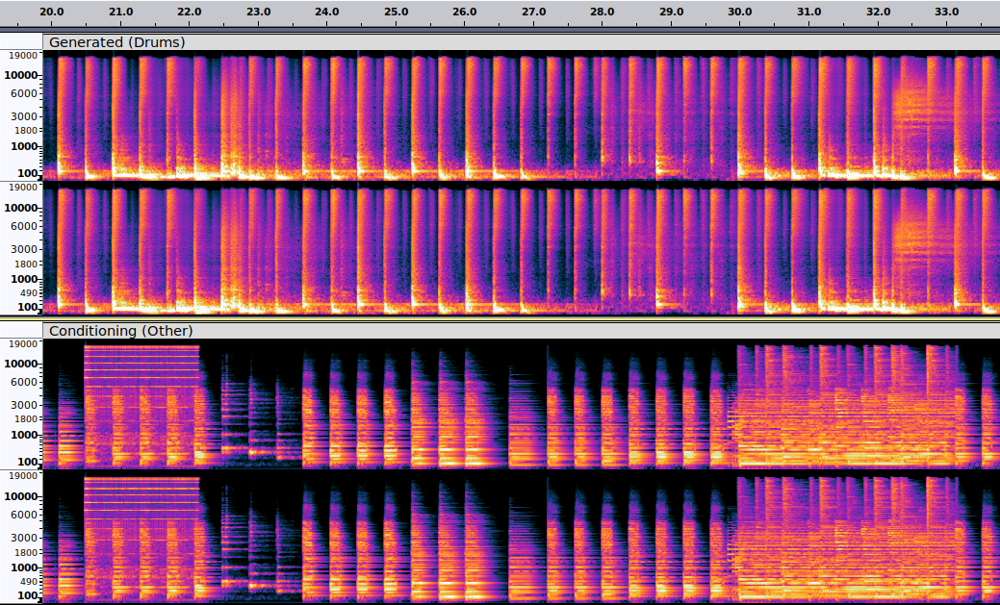

# Stable Audio ControlNet

Fine-tune Stable Audio Open with DiT ControlNet. On 16GB VRAM GPU you can use adapter of 20% the size of the full DiT with bs=1
and mixed fp16 (50% with 24GB VRAM GPU). **Work in progress!**

  


Example:

- [Input (Other)](res/track1/input.wav)
- [Generated (Drums)](res/track1/generated.wav)
- [Mix](res/track1/mix.wav)

# Quick start
To initialize ControlNet based on `stable-audio-open` checkpoint, retaining `depth_factor` layers (e.g., `depth_factor` = 0.2 retains 20% of layers
in DiT, int(0.2 * 24) = 5 layers), call:

```python
from main.controlnet.pretrained import get_pretrained_controlnet_model

model, model_config = get_pretrained_controlnet_model("stabilityai/stable-audio-open-1.0", depth_factor=0.2)
```

**For training** first disable training on frozen structures:

```python
model.model.model.requires_grad_(False)
model.conditioner.requires_grad_(False)
model.conditioner.eval()
model.pretransform.requires_grad_(False)
model.pretransform.eval()
```
And pass only ControlNet adapter to optimizer:

```python
params = list(self.model.model.controlnet.parameters())
optimizer = torch.optim.AdamW(params, lr)
```

During training pass the conditioning audio `y` in the conditioning dictionary 

```python
x, y, prompts, start_seconds, total_seconds = batch
...
# obtain noised_input from x at time t
...
# we pass controlnet conditioning with id "audio" in the conditioning dictionary
conditioning = [{"audio": y[i:i+1],
                 "prompt": prompts[i], 
                 "seconds_start": start_seconds[i],
                 "seconds_total": total_seconds[i]} for i in range(y.shape[0])]
output = model(x=noised_inputs, 
               t=t.to(device),
               cond=model.conditioner(conditioning),
               cfg_dropout_prob=cfg_dropout_prob,
               device=device))
# compute diffusion loss with output
```

For **inference** call for example:
```python
from stable_audio_tools.inference.generation import generate_diffusion_cond

# define conditioning dictionary
assert batch_size == len(conditioning)

output = generate_diffusion_cond(
                model,
                steps=steps,
                batch_size=batch_size,
                cfg_scale=7.0,
                conditioning=conditioning,
                sample_size=sample_size,
                sigma_min=0.3,
                sigma_max=500,
                sampler_type="dpmpp-3m-sde",
                device="cuda"
        )
```

# Implementation Details

The ControlNet architecture is implemented by defining two classes (in `diffusion.py`):

- `DiTControlNetWrapper`
  - It extends the standard `DiTWrapper`, which contains a `DiffusionTransformer`, with a `ControlNetDiffusionTransformer` 
    defined in `controlnet.py`. The latter has a structure copied from the `DiffusionTransformer` (reducing the number of 
    layers via a `controlnet_depth_factor`) and inputs a `controlnet_cond` alongside all inputs that we give to `DiffusionTransformer`. 
    The processed inner layers `controlnet_embeds` are returned and given as input to the `DiffusionTransformer`. The latter contains a version 
    of `ContinuousTransformer` modified to take as input `controlnet_embeds` which are summed across the layers corresponding 
    to the layers of `ControlNetDiffusionTransformer`.

- `ConditionedControlNetDiffusionModelWrapper`
  - It contains a `DiTControlNetWrapper` and handles the conditioning tensors which are passed to `DiTControlNetWrapper`:
    we add a new `controlnet_cond` type which is the conditioning tensor of the ControlNet adapter.

# TODO
- [x] Add training code.
- [x] Add generation code.
- [x] Improve inference demo.
- [x] Enable CFG.
- [x] Use time conditioning in demo.
- [x] Add input and embeds ControlNet conditioning scales.
- [x] Add envelope ControlNet.
- [ ] Release demo checkpoints.
- [ ] Add multi ControlNet.
- [ ] Add F0 or chord ControlNet.

#  Demo 
In the following we detail training a model for music source accompaniment generation on MusDB.

## Setup
First install the requirements. `torchaudio` has to be installed as the nightly build. You can do it with `pip3 install --pre torchaudio --index-url https://download.pytorch.org/whl/nightly/cu118`.  Afterwards copy `.env.tmp` as `.env` and replace with your own variables (example values are random):

```
DIR_LOGS=/logs
DIR_DATA=/data

# Required if using wandb logger
WANDB_PROJECT=audioproject
WANDB_ENTITY=johndoe
WANDB_API_KEY=a21dzbqlybbzccqla4txa21dzbqlybbzccqla4tx
```

Afterwards, log in on Hugginface with `huggingface-cli login` using personal token in order to be able to download
Stable Audio Open weights.

For the demo, since we are using `mp3` version of musdb, it is also necessary to have `libsndfile` installed. You can install it with `conda install conda-forge::libsndfile`.

## Dataset (MusDB18HQ)

First download the sharded version of [MusDB18HQ](https://sigsep.github.io/datasets/musdb.html#musdb18-compressed-stems) from https://drive.google.com/drive/folders/1bwiJbRH_0BsxGFkH0No-Rg_RHkVR2gc7?usp=sharing
and put the files `test.tar` and `train.tar` inside `data/musdb18hq/`.

## Train

For training run
```
PYTHONUNBUFFERED=1 TAG=musdb-controlnet python train.py exp=train_musdb_controlnet \
datamodule.train_dataset.path=data/musdb18hq/train.tar \ 
datamodule.val_dataset.path=data/musdb18hq/test.tar
```

# Credits

- Evans, Z., Parker, J. D., Carr, C. J., Zukowski, Z., Taylor, J., & Pons, J. (2024). Stable Audio Open. arXiv preprint arXiv:2407.14358.
- Zhang, L., Rao, A., & Agrawala, M. (2023). Adding conditional control to text-to-image diffusion models. In Proceedings of the IEEE/CVF International Conference on Computer Vision (pp. 3836-3847).
- Chen, J., Wu, Y., Luo, S., Xie, E., Paul, S., Luo, P., ... & Li, Z. (2024). Pixart-{\delta}: Fast and controllable image generation with latent consistency models. arXiv preprint arXiv:2401.05252.
